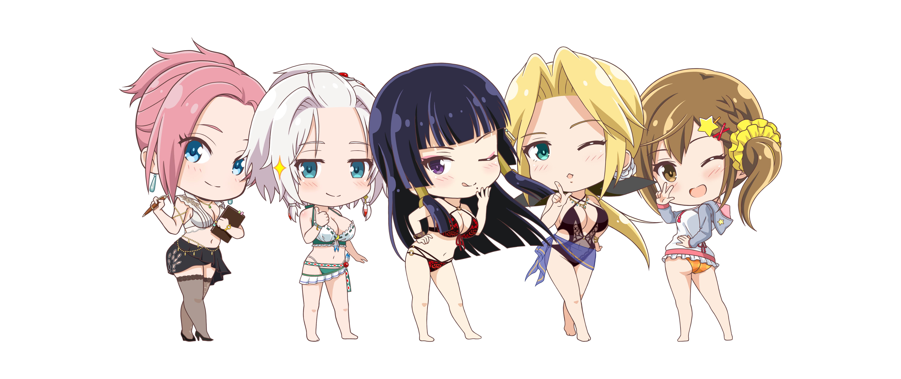
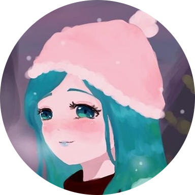
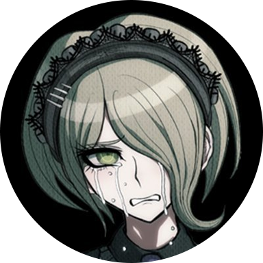

  

  <!-- ### _Enter the universe through the eyes of the Tengu! 💕_ -->

  ### _Delving into the universe through the eyes of the Tengu since 2020 💕_

   
   

  We are **#MamaNyoSquad**, tbmassoc's sole DEAD OR ALIVE Collective that focus (and promote) primarily on events involving the Venus Vacation Series -- DOAXVV and PRISM!

  Established since 6 Dec 2020 (and incorporated since 1 May 2022 as part of tbmassoc), we continue our commitment to preserving the DOA legacy for future generations to come.

   

  ## The SquadMates

  <table>
    <tr>
      <td width="50%" align="center">
        
        <h3>Aga-chuu, G.Mgr</h3>
        
      </td>
      <td width="50%" align="center">
        
        <h3>Emmannuel Ortega, SocWeb Mgr</h3>
        
      </td>
    </tr>
  </table>

   
   

  **©2020 #MamaNyoSquad&ensp;&bull;&ensp;a proud brand of tbmassoc**

